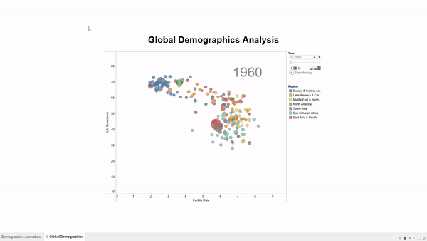

# Global Demographics Analysis

### Link to Dashboard: https://public.tableau.com/views/GlobalDemographics_16279464394800/GlobalDemographics?:language=en-GB&:retry=yes&:display_count=n&:origin=viz_share_link

## Description
A Tableau Dashboard animated visualisation of the life expectancy and fertility rate of countries from 1960 - 2013. Made using Tableau Desktop. Dataset taken from https://data.worldbank.org/. 

The countries are formatted as bubbles and colour-coded by region. The size of the bubbles indicates the size of the population. Fertility rate is on the x-axis and life expectancy is on the y-axis. As the years progress, the fertility rate declines and life expectancy increases for many countries. 

## Note 
Interacting with the Dashboard on Tableau Public is slow due to the high volume of data used. It is best to check out how it works via the demo below.

## Demo

