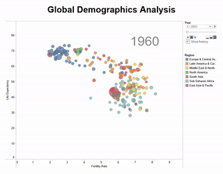

# Description
A Tableau Dashboard animated visualisation of the life expectancy and fertility rate of countries from 1960 - 2013. Made using Tableau Desktop. Dataset taken from https://data.worldbank.org/.

## Note 
Interacting with the Dashboard on Tableau Public is slow due to the high volume of data used. It is best to check out how it works via the demo below.

